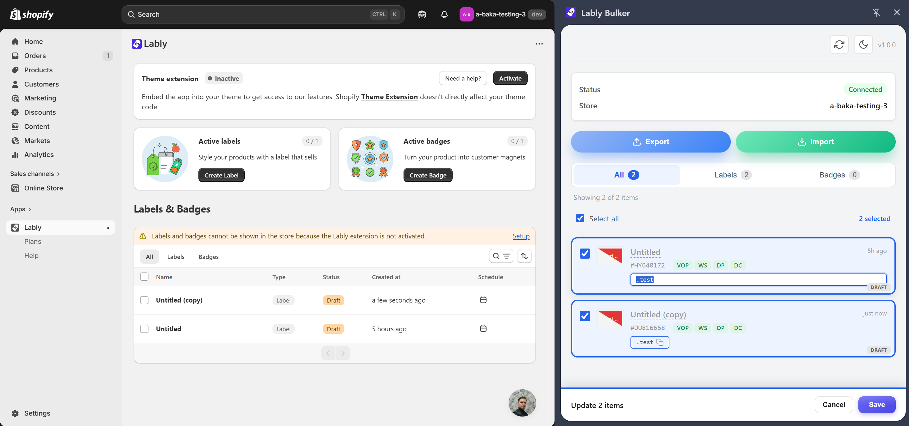

# Lably Bulker

A Chrome extension that supercharges your [Lably](https://lably.devit.software) workflow by letting you manage all your labels and badges in bulk — directly from the Shopify admin sidebar.

---

## Why Lably Bulker?

Managing labels and badges one by one in the Lably editor is tedious when you have dozens of items to update. Lably Bulker brings them all into a single side panel so you can view, edit, export, and import in one place — without leaving Shopify admin.

---

## Features

### Bulk Selector Editing
- See every label and badge selector at a glance
- Click any selector to edit it inline
- When multiple items are selected, the same selector change propagates to all of them simultaneously

### Export & Import
- Export all your current labels/badges to a JSON file with one click — no network requests, uses cached data for instant download
- Import a JSON file to batch-create labels/badges (500 ms delay between creates to avoid rate limits)

### Advanced Per-Device Styling
- Click any card to open its advanced panel with **Desktop / Tablet / Mobile** tabs
- Edit **Font Size** (px / rem / em), **Width & Height** (px / %), **Padding** (T/R/B/L, px / %), and **Margin** (T/R/B/L, px / %) per device
- **Desktop fallback**: if tablet or mobile have no values set, desktop values are shown as a reference
- **1:N spread toggle** next to each property group — switch from `1` (current screen only) to `N` (all screens at once)
  - Switching to N automatically copies the current device's values to all three devices
  - In N mode, editing any padding/margin side also fills the other sides from the current device

### Visibility on Pages
- Collapsible "Visibility on Pages" section per item
- Toggle: Home Page, Product Pages, Search Results Pages, Cart Page, Collection Pages, Other Pages

### Auto-Sync
- Automatically detects when you save changes inside the Lably editor (via webRequest listener) and refreshes the panel
- Debounced (1 s) + throttled (max once per 2 s) so it never floods the API
- Manual sync button in the header for on-demand refresh
- Switching stores triggers an automatic resync

### Visual Card Previews
- Each card renders the label/badge shape (rectangle, circle, parallelogram, tag, ribbon, trapezoid, triangle, chevron) using the same clip-path/transform logic as the app itself
- Status indicators (VoP, WS, DP, DC) with ok/warning states and hover tooltips, matching the Lably editor UI

### Bulk Save
- Sticky bottom bar shows how many items have pending changes
- Save or cancel all pending edits in one click
- Changes propagate to all selected items across selector, advanced styles, and visibility

### Draft & Badge Badges
- Draft items are visually greyed with a DRAFT corner badge
- Badge-type items show a B corner tag; when both exist, DRAFT shifts left to avoid overlap

### Light / Dark Theme
- System-aware theme toggle in the header

---

## Installation

1. Clone or download this repository
2. Open Chrome and go to `chrome://extensions`
3. Enable **Developer mode** (top right toggle)
4. Click **Load unpacked** and select the project folder
5. Navigate to your Shopify admin (admin.shopify.com) and open the Lably app
6. Click the Lably Bulker extension icon — the side panel will open

> **Note:** The extension requires the Lably iframe to be loaded in the Shopify admin tab. If you see a "Lably not enabled" error, wait a few seconds and hit the sync button — the iframe may still be loading.

---

## Usage

### Updating selectors in bulk
1. Check the checkbox on 2+ cards to select them
2. Click the selector text on any selected card to edit it
3. The new selector is applied to all selected items
4. A **Save** bar appears at the bottom — click **Save** to push changes to the Lably API

### Using the 1:N spread toggle
1. Open a card's advanced panel (click the card body)
2. Switch to the **Tablet** or **Mobile** tab
3. Click the `1` button next to a property to turn it into `N` — values will spread to all devices
4. Edit values as normal; all screens update together

### Export / Import
- **Export**: Click **Export** — a JSON file downloads instantly with all current items
- **Import**: Click **Import**, select a previously exported JSON — items are created one by one with progress feedback

---

## Architecture

| File | Role |
|---|---|
| `manifest.json` | Extension config (MV3), permissions |
| `inject.js` | Hooks `window.fetch` in Shopify admin (MAIN world) to capture CSRF token |
| `content.js` | Bridges postMessage from inject.js to chrome.runtime |
| `background.js` | Service worker — session persistence, webRequest mutation listener, side panel opener |
| `sidepanel.html` | Side panel UI shell |
| `sidepanel.css` | Light/dark theme, card styles, advanced panel, toast |
| `sidepanel.js` | All UI logic — rendering, API calls, state management, bulk operations |

Lably API calls are executed via `chrome.scripting.executeScript` inside the Lably iframe (same-origin requirement). The Lably server rejects requests from non-same-origin callers, so executing inside the iframe is the only reliable approach.

---

## Requirements

- Google Chrome (or Chromium-based browser with MV3 support)
- Lably app installed on your Shopify store
- Shopify admin access (admin.shopify.com)
